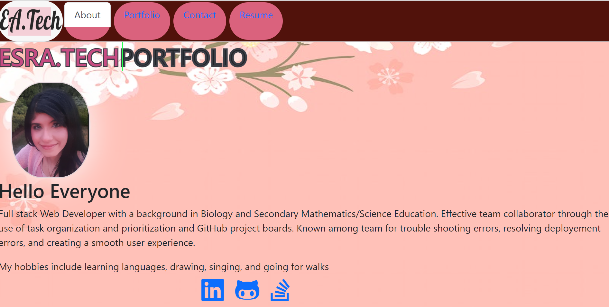

# Tech Portfolio

## Description

A tech portfolio created using React.js to showcase my web developement work to potential hiring managers. This portfolio highlights my projects, both deployements and demos, as well as a downloadable resume.

## Table of Contents

- [Description](#Description)
- [License](#License)
- [Deployement](#Deployement)
- [Questions](#Questions)

## Deployement
[click here](https://esrawameed.github.io/techPortfolio/) To visit my portfolio.

## Screanshot of APP

## License
The Application is covered under MIT license
Learn more about the license from the following link: [https://choosealicense.com/licenses/mit](https://choosealicense.com/licenses/mit)

## Questions
If you would like to get in touch or have any questions, please don't hesitate to email me at abduljabaresra0@gmail.com
